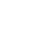
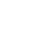

# Enchant Guesser

A simple browser game that challenges you to decode Minecraft’s enchanting-table runes!

## What Is It?

In **Enchant Guesser**, you’re shown one of the mysterious runic symbols used in Minecraft’s enchantment table. Each rune corresponds to a letter (A–Z). Your goal is to guess which enchantment name the symbol belongs to.

- **5 rounds per game**
- **Up to 5 guesses per round**
- **–1 000 points** for each wrong guess
- **+5 000 points** if you guess correctly on the 1st try, +4 000 on the 2nd, … down to +1 000 on the 5th
- **Perfect score: 25 000 points**

At game end you see your total and a breakdown of points per round.

## Symbol Key

Below is the full decoding table: each rune image and its corresponding letter.

|  A |  B |  C |  D |  E |  F |  G |  H |  I |  J |  K |  L |  M |
| --------------------------------- | --------------------------------- | --------------------------------- | --------------------------------- | --------------------------------- | --------------------------------- | --------------------------------- | --------------------------------- | --------------------------------- | --------------------------------- | --------------------------------- | --------------------------------- | --------------------------------- |
|  N |  O |  P |  Q |  R |  S |  T |  U |  V |  W |  X |  Y |  Z |
